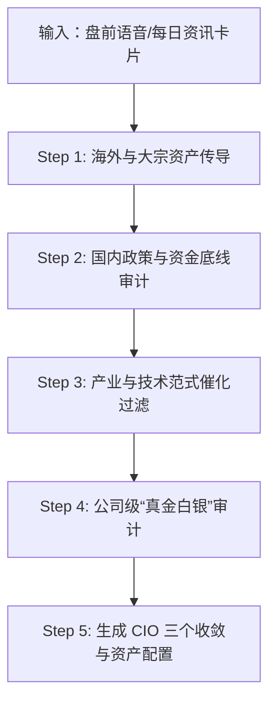

# [研报技能] Premarket Audio & Transcript Analysis Skill (买方盘前分析技能)

本 Skill 沉淀自买方顶级金融博主的 08:00 盘前语音分析方法论，旨在指导 Agent（`AnalystAgent`、`SynthesizerAgent` 与 `ExtractorAgent`）像专业买方基金经理与 CIO 一样，从杂乱的市场资讯中提取核心催化剂、剥离伪利好、推演跨行业传导链，并生成具备买方实战价值的盘前策略研报。

---

## 💡 深度分析思维模型 (Theory of Mind & Analytical Rationale)

为了避免传统 Agent 的“机械摘要”与“字面总结”，Agent 在执行分析时必须内化以下买方逻辑背后的**本质原因 (Why)**：

### 1. 为什么必须严格区分“注销式回购”与“股权激励回购”？
- **底层逻辑**：只有公告明确注明**“用于注销注册资本（缩股）”**的回购，才会真实减少全市场总股本 ($N$)，从而立即提升单股收益率 $EPS = \frac{\text{净利润}}{N}$，直接降低市盈率 $P/E$，属于真金白银提升股东权益的重大利好。
- **伪利好识别**：用于“员工持股计划”或“股权激励”的回购，本质上未来仍会通过行权抛售回市场，甚至可能稀释现有股东权益，仅能视为中性事件。

### 2. 为什么二季度（Q2）环比加速（QoQ）远比单季同比高增（YoY）重要？
- **底层逻辑**：单季同比高增往往受去年同期低基数（Base Effect）干扰，无法反映企业当下的真实经营斜率。
- **斜率边际变化**：Q2 净利润较 Q1 出现显著环比加速（如 Q2 环比增长 > 50%），证明产品在当下季度正在加速渗透与交付，是机构资金最偏爱的“基本面加速”信号。

### 3. 为什么必须联动海外美股与日韩半导体链条？
- **底层逻辑**：全球硬科技产业链高度耦合。美国四巨头（微软/谷歌/亚马逊/Meta）的资本支出（Capex）指引是国内光模块、服务器、CPO/NPO 超节点需求的先导指标。
- **供应链滞后传导**：日韩龙头（海力士、三星电机、太阳诱电）掌控全球 60%+ 的存储与被动元件产能，其发出的价格上涨函（Price Hike Notice）预示行业供需格局出现扭转，会滞后 1-2 个季度传导至 A 股对标公司。

### 4. 为什么 CIO 策略要聚焦“三个收敛” (Three Convergences)？
- **底层逻辑**：在市场分化与震荡行情中，单一板块（如上游硬件）的斜率暴涨无法无限持续，估值极值必然引发套利与轮动资金的再平衡：
  1. **上下游收敛**：上游硬件挤泡沫，资金向业绩可兑现的下游 AI 应用与桌面 Agent 倾斜。
  2. **中外折价收敛**：国内高端制造相对于海外对标公司的折价出现修复。
  3. **风格收敛**：科技独秀向资源、高股息、医药、大消费等非科技板块收益率均衡化。

---

## 🎯 核心分析协议 (5-Step Execution Workflow)

Agent 在处理盘前文本或每日资讯时，必须遵循以下 5 步递进工作流：



### Step 1: 海外与大宗资产传导 (Global & Commodity Spillover)
- 检查美股三大指数、费城半导体、纳斯达克中国指数（中概股）走势。
- 跟踪美股科技巨头财报与 Capex 变化（如谷歌资本支出提升至 2050 亿美元）。
- 追踪日韩存储（海力士/威刚）与被动元件 MLCC（三星电机/太阳诱电）统一涨价信号。
- 监测布伦特/WTI 原油价格是否突破 $80/$90/桶压测关口，及黄金/白银避险走势。

### Step 2: 国内政策与资金底线审计 (Domestic Policy & Capital Floor)
- 审计主力资金托底动作：跟踪宽基 ETF 连续净流入额（如 3800 点关键防线托底）。
- 跟踪监管导向：证监会防风险、强监管政策表态与座谈会信号。
- 审计公募持仓切换：分析二季报重仓股结构性变动（如宁德时代退居第四、中际旭创升至第一）。

### Step 3: 产业与技术范式催化过滤 (Industry & Technical Catalyst)
- 识别新封装与网络结构：CPO/NPO 超节点、数据中心燃气轮机替代能源。
- 识别政策与地方抓手：token 经济/token 工厂建设、核电/新型电力系统十五规划。
- 识别行业反内卷：指导性成本定价文件（如《光伏行业成本核算模型通则》）及价格合规约谈。

### Step 4: 公司级“真金白银”审计 (Corporate Quality Audit)
- **回购审计**：严格校验回购用途是否包含“注销注册资本”。
- **业绩审计**：计算 Q2 环比 acceleration，区分纯同比高增与环比加速。
- **订单与增持**：校验跨年度长单金额占营收比重（>15% 视为重大催化），跟踪高管自筹资金增持。

### Step 5: 市场策略与“三个收敛”生成 (Synthesizer CIO)
在全篇研报第一章【## 一、总评】中，组装包含“三个收敛”的 CIO 资产配置与仓位管理建议。

---

## 📝 输出示范与示例 (Examples Pattern)

### 示例 1: Analyst Agent 公司级利好审计输出
- **输入新闻**：“宁德时代发布二季报，上半年利润432亿元，同时宣布掏出最高400亿元回购股份，回购股份将全部用于注销注册资本。”
- **Skill 规范输出**：
  ```markdown
  #### 【整体结论】
  当前板块龙头展现出极强的业绩兑现能力与资本管理诚意。公司抛出历史上极为罕见的400亿元【注销式回购】，直接缩减总股本提升 EPS，将显著提振新能源板块估值底线。
  
  #### 【关键事件】
  1. 宁德时代上半年实现利润 432 亿元（同比增长 42%），业绩兑现度极高。
  2. 公司宣布最高 400 亿元真金白银回购且全部用于注销注册资本（缩股），大幅改善全行业内卷预期。
  ```

### 示例 2: Synthesizer Agent CIO 三个收敛策略输出
- **Skill 规范输出**：
  ```markdown
  ### 大类资产配置与仓位建议
  当前市场在 3800 点区间已展现出清晰的政策底与资金托底迹象（国家队 ETF 连续 11 个交易日累计净流入超 3500 亿元）。策略上建议维持 6-7 成中性偏高仓位，重点把控“三个收敛”的轮动节奏：
  1. **上下游收敛**：上游硬件挤泡沫压测接近尾声，关注下游 AI 应用与桌面 Agent（如 WorkBuddy、金山办公）的业绩兑现。
  2. **中外折价收敛**：关注受高利率压制后处于历史估值低位的国内高端装备与电力设备。
  3. **风格收敛**：适当均衡配置高股息、能源、资源及医药等非科技低估值板块。
  ```

---

## ⚠️ 常见误区与边缘边界 (Edge Cases & Pitfalls)

1. **误区：见回购即看多** -> 必须检测是否“注销注册资本”，非注销回购严禁给出“特大利好”评级。
2. **误区：高同比即看多** -> 必须排查是否属于去年低基数异常，若 Q2 环比出现下滑，需给出“中性偏谨慎”警示。
3. **误区：忽视海外连锁反应** -> 即使国内暂无消息，若日韩 MLCC/存储发布统一 30% 涨价函，国内被动元件与存储链必须上调情绪预期。
4. **误区：格式与 Emoji** -> 严格遵守正式买方报告规范，严禁在正文中使用任何视觉 Emoji 符号，统一采用 `[看多]`、`[看空]`、`[风险警示]` 方括号标签。

---

## 📂 资源关联 (Bundled Resources)

- 详细买方启发式手册: `references/heuristics.md`
- 自动化信号审计提取工具: `scripts/extract_audio_insights.py`

---

## 🛠️ 代码层 Agent 调起方式

在 Python 代码中通过 `SkillLoader` 动态注入：
```python
from app.core.skill_loader import SkillLoader

# 动态加载 Skill 内容并注入 Prompt
skill_prompt = SkillLoader.load_skill_prompt("premarket-audio-analysis")
prompt = f"{SYSTEM_PROMPT}\n\n{skill_prompt}\n\n{user_prompt}"
```
